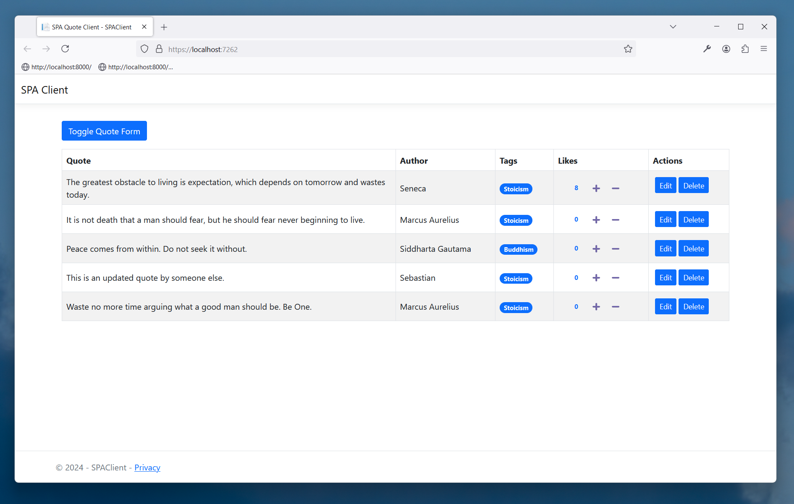
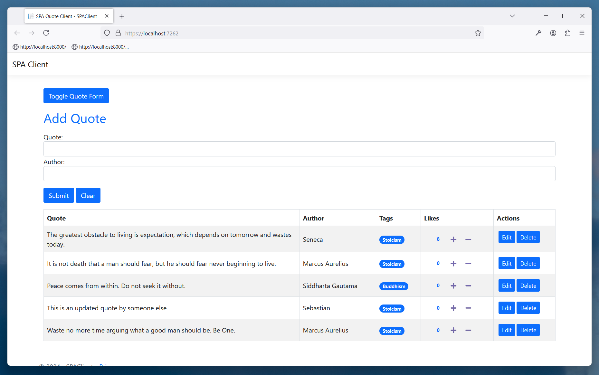
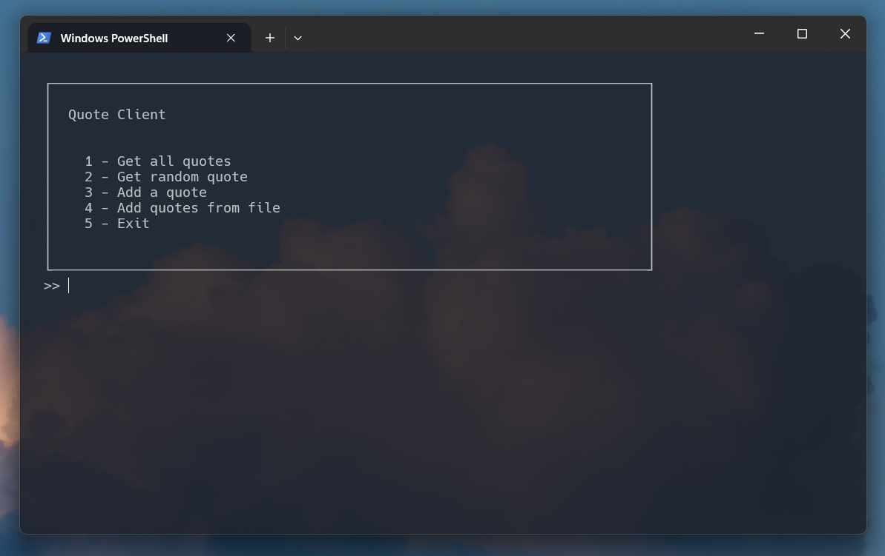
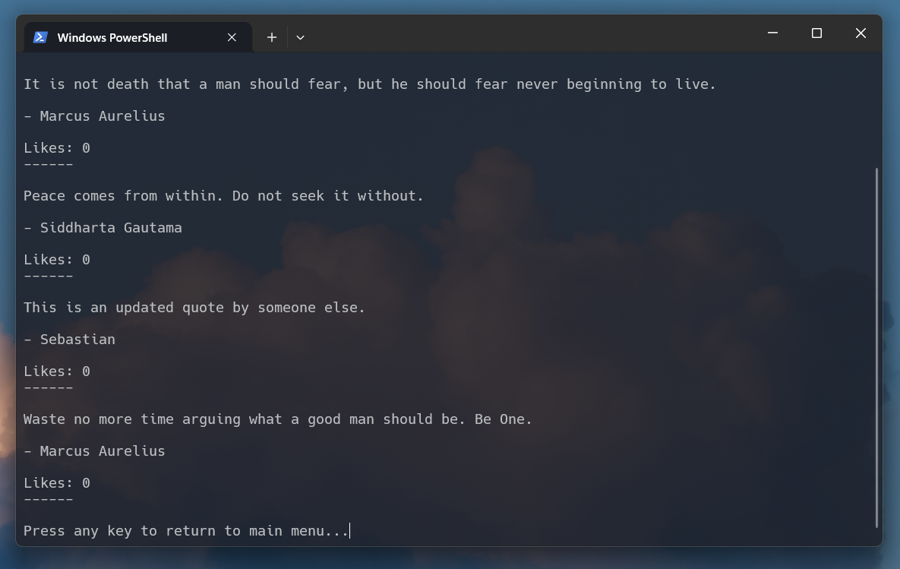

# QuotePost 📜

## What is it?
QuotePost is a platform for posting quotes. It allows for creating, deleting, and liking quotes.

## Project Structure
The QuotePost API backend was written in C# with ASP.NET Core. The API stores quote in a MSSQL database using EF Core. There are 2 client apps. An ASP.NET Core web app and a CLI Python client.

## Screenshots
### ASP.NET SPA Client

### Python CLI Client

